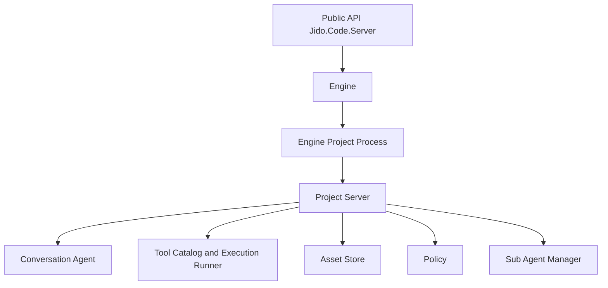

# 01. Guide Map

Prev: `None`  
Next: [02. System Architecture](./02-system-architecture.md)

## What This Set Covers

These guides document the architecture implemented in `lib/jido_code_server`:

- Engine and project lifecycle
- Conversation runtime on `Jido.AgentServer`
- Canonical journaling via `Conversation.JournalBridge` + `jido_conversation`
- Tool catalog, policy enforcement, and execution
- Sub-agent spawning and lifecycle management
- Protocol adapters (MCP and A2A)
- Security controls and telemetry
- Operational diagnostics and test strategy

## Mental Model

`Jido.Code.Server` is a multi-project runtime. Each project has isolated state, policy, assets, conversations, and async execution capacity.

## Recommended Reading Path

1. Start with system architecture and runtime topology.
2. Read assets and conversation runtime to understand state.
3. Read LLM/tool and sub-agent guides for execution flow.
4. Read protocol, security, and operations guides for production concerns.
5. Finish with testing to map guarantees to code.

## Core Source Anchors

- `lib/jido_code_server.ex`
- `lib/jido_code_server/engine.ex`
- `lib/jido_code_server/project/server.ex`
- `lib/jido_code_server/conversation/agent.ex`
- `lib/jido_code_server/conversation/journal_bridge.ex`
- `lib/jido_code_server/project/execution_runner.ex`
- `lib/jido_code_server/project/policy.ex`
