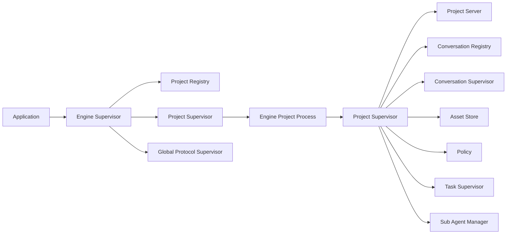

# 02. System Architecture

Prev: [01. Guide Map](./01-guide-map.md)  
Next: [03. Runtime Topology and Lifecycle](./03-runtime-topology-and-lifecycle.md)

## Goals

`Jido.Code.Server` provides a project-scoped coding runtime with these design choices:

- One engine manages many projects.
- Each project is isolated by process tree and policy state.
- Conversation traffic is signal-first (`Jido.Signal`) and state-reducer driven.
- Tool execution is centralized through one policy-gated path.
- Security telemetry is first-class.

## Public Surface

The main API in `lib/jido_code_server.ex` delegates to `Engine`:

- Project lifecycle: `start_project/2`, `stop_project/1`, `list_projects/0`
- Conversation lifecycle and interaction: `start_conversation/2`, `conversation_call/4`, `conversation_cast/3`, `conversation_state/3`, `conversation_projection/4`
- Tool and asset APIs: `list_tools/1`, `run_tool/2`, `list_assets/2`, `get_asset/3`, `search_assets/3`
- Diagnostics: `conversation_diagnostics/2`, `incident_timeline/3`, `diagnostics/1`

## Top-Level Component Graph

## Core Runtime Boundaries

- `Engine`: validates runtime options and routes project operations.
- `Project.Server`: project control plane, conversation routing, diagnostics assembly.
- `Conversation.Agent`: state machine for one conversation.
- `Policy`: authorization and sandbox checks.
- `ToolRunner`: execution and guardrails.
- `SubAgentManager`: child-agent lifecycle.
- `Telemetry`: event stream, counters, redaction, and incident support.

## Security Aside

The architecture enforces policy close to execution, not just at API ingress. `ToolRunner` always calls `Policy.authorize_tool/6` before executing a tool, even for internal orchestration paths.
