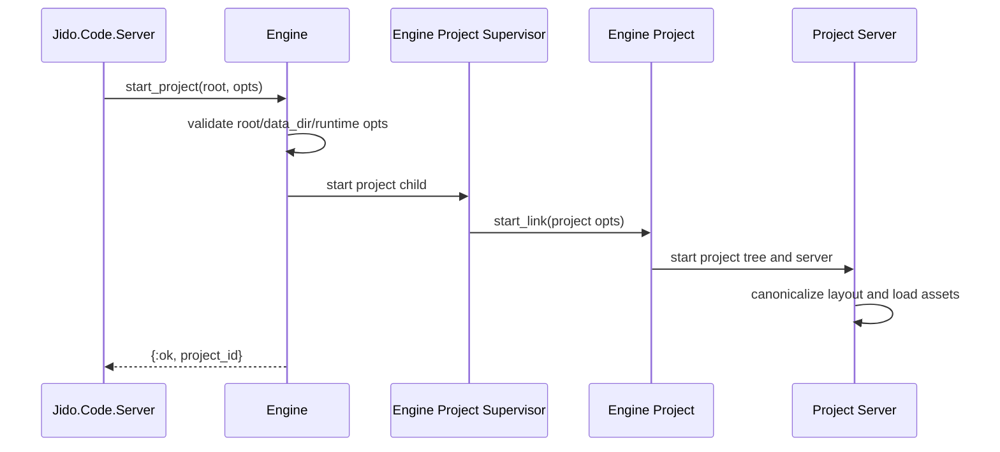

# 03. Runtime Topology and Lifecycle

Prev: [02. System Architecture](./02-system-architecture.md)  
Next: [04. Assets and Project State](./04-assets-and-project-state.md)

## Supervision Model

### Global

- `Jido.Code.Server.Application` starts `Engine.Supervisor`.
- `Engine.Supervisor` starts:
  - `Engine.ProjectRegistry`
  - `Engine.ProjectSupervisor` (dynamic)
  - `Engine.ProtocolSupervisor` (global MCP/A2A gateways)

### Per Project

Each project started through `Engine.start_project/2` gets:

- `Engine.Project` process
- `Project.Supervisor` tree with:
  - `ConversationRegistry`
  - `ConversationSupervisor`
  - `AssetStore`
  - `Policy`
  - `TaskSupervisor`
  - `SubAgentManager`
  - `Project.ProtocolSupervisor` (project-scoped MCP/A2A protocol servers when allowlisted)
  - `Project.Server`
  - optional `Watcher`

## Lifecycle: Start Project

## Runtime Option Path

`Engine` validates and normalizes runtime options before any project starts. Important options include:

- Tool limits (`tool_timeout_ms`, output/artifact caps, concurrency)
- Conversation limits (`conversation_max_queue_size`, `conversation_max_drain_steps`)
- Security controls (network policy/allowlist, sensitive path rules, env allowlist)
- Sub-agent defaults (`subagent_max_children`, `subagent_ttl_ms`, templates)
- LLM adapter/model/system prompt settings

## Lifecycle: Start Conversation

`Project.Server`:

1. Generates or accepts `conversation_id`
2. Builds `project_ctx` (policy/task manager/LLM config/sub-agent manager)
3. Starts `Conversation.Agent` under `ConversationSupervisor`
4. Registers pid in `ConversationRegistry`
5. Monitors pid for cleanup and telemetry

## Failure Containment

- Project failures are isolated by per-project supervision.
- Conversation failure does not kill project runtime; monitored cleanup removes stale registry entries.
- Tool execution runs in supervised tasks and enforces timeout and child process cleanup.

## Security Aside

Project-level process boundaries align with project-level policy state. This prevents one project’s allowlist or telemetry context from leaking into another.
