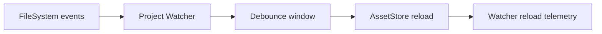

# 04. Assets and Project State

Prev: [03. Runtime Topology and Lifecycle](./03-runtime-topology-and-lifecycle.md)  
Next: [05. Conversation Runtime](./05-conversation-runtime.md)

## Layout Contract

`Project.Layout` ensures a deterministic on-disk structure under `<root>/<data_dir>`:

- `skills/`
- `commands/`
- `workflows/`
- `skill_graph/`
- `state/`

## Asset Store Design

`Project.AssetStore` is an ETS-backed, generation-based snapshot store.

### Inputs

- Loaders read markdown assets:
  - `Loaders.Skill`
  - `Loaders.Command`
  - `Loaders.Workflow`
  - `Loaders.SkillGraph`

### Outputs

- Query APIs: `list`, `get`, `search`
- Diagnostics:
  - generation
  - per-type versions
  - counts
  - load errors
  - last loaded timestamp

### Swap Semantics

Load/reload builds a full new ETS table, then swaps atomically. Previous table is dropped only after new snapshot is valid.

## Strict vs Non-Strict Loading

- `strict_asset_loading = true`: parse/load errors fail startup or reload.
- `strict_asset_loading = false`: errors are recorded in diagnostics/telemetry; previous snapshot remains usable.

## Watcher Flow

If enabled, `Project.Watcher` subscribes to filesystem events in watched asset directories and debounces reload.

## Skill Graph Notes

`Loaders.SkillGraph` parses wiki-style links like `[[TargetNode]]` and emits:

- `nodes`: file-derived graph nodes
- `edges`: deduplicated and sorted `from -> to` links

## Security Aside

Asset loading intentionally stays local to project filesystem layout; network access is not part of loader execution.
