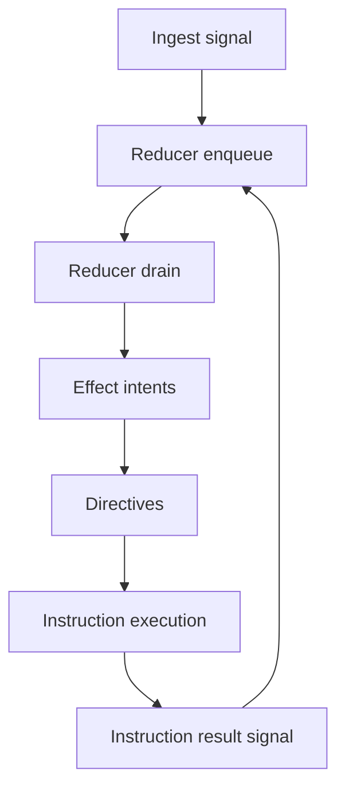

# 05. Conversation Runtime

Prev: [04. Assets and Project State](./04-assets-and-project-state.md)  
Next: [06. LLM and Tool Execution](./06-llm-and-tool-execution.md)

## Runtime Model

Each conversation runs as `Jido.Code.Server.Conversation.Agent` (a `Jido.Agent` on `Jido.AgentServer`).

State includes:

- `domain` (`Conversation.Domain.State`)
- `project_ctx` (tool, policy, LLM, sub-agent references)
- stable identifiers (`project_id`, `conversation_id`)

## External Conversation API Contract

External calls/casts only accept these signal types:

- `conversation.user.message`
- `conversation.cancel`
- `conversation.resume`

All other canonical `conversation.*` signals are internal runtime flow (instruction results, tool lifecycle, LLM lifecycle, queue/system events).

## Canonical Signal Path

1. API receives `%Jido.Signal{}`.
2. `Conversation.Agent.call/3` wraps it as `conversation.cmd.ingest`.
3. `IngestSignalAction` normalizes and enqueues.
4. `Reducer.drain_once/1` applies queued signals deterministically.
5. Effect intents map to directives.
6. Instruction results are re-ingested as canonical conversation signals.

Signal envelope contract:

- Runtime normalization only reads payload from `signal.data` (or `"data"` in map input).
- Flat top-level payload fields are rejected with `:missing_data_envelope`.

## Domain State and Reducer

`Conversation.Domain.State` tracks:

- `timeline` (applied signals)
- `event_queue` and `queue_size`
- `pending_tool_calls`
- `pending_subagents`
- `correlation_index`
- `projection_cache`
- queue/drain limits and orchestration flag

Reducer guarantees:

- Dedup by `{signal.id, correlation_id}`
- Overflow emits `conversation.queue.overflow`
- Max drain steps produce `continue_drain` intent
- Deterministic projection recomputation

## Directive Boundary

Side effects are not executed in the reducer. Intents are mapped to directives:

- `run_llm` -> `RunLLMInstruction`
- `run_tool` -> `RunToolInstruction`
- `cancel_pending_tools` -> `CancelPendingToolsInstruction`
- `cancel_pending_subagents` -> `CancelSubagentsInstruction`

## Projections

Built by `Conversation.Domain.Projections`:

- `timeline`
- `llm_context`
- `diagnostics`
- `subagent_status`
- `pending_tool_calls`

`Project.Server` also exposes canonical journal-backed projections:

- `canonical_timeline`
- `canonical_llm_context`

These are sourced from `Conversation.JournalBridge` and `jido_conversation`.

## Canonical Journaling

`Conversation.JournalBridge` ingests runtime signals into `jido_conversation` using ingest adapters:

- user messages -> `Ingest.Adapters.Messaging`
- assistant/tool outbound lifecycle -> `Ingest.Adapters.Outbound`
- non-mapped runtime signals -> audit fallback (`conv.audit.policy.decision_recorded`)

Metadata enrichment keeps `project_id`, `correlation_id`, and `cause_id` available for diagnostics and incident analysis.

## Cancel and Resume

- `conversation.cancel` marks status cancelled and emits cancellation intents.
- Non-resume signals do not trigger orchestration while cancelled.
- `conversation.resume` returns state to `:idle` and normal flow can continue.

## Subscriber Model

`Project.Server` supports subscriber pids per conversation. After each call/tool-ingest update, new timeline entries are delivered as `{:conversation_event, ...}` and assistant deltas as `{:conversation_delta, ...}`.

## Security Aside

Correlation IDs are ensured at signal normalization boundaries and propagated through conversation, tool, sub-agent, telemetry, and canonical journal paths.
