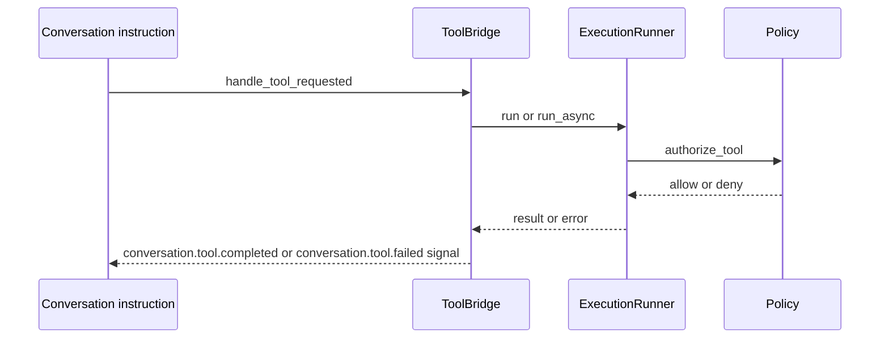

# 06. LLM and Tool Execution

Prev: [05. Conversation Runtime](./05-conversation-runtime.md)  
Next: [07. Sub Agent Runtime](./07-subagent-runtime.md)

## LLM Execution Path

`RunLLMInstruction` executes one LLM turn:

1. Emits `conversation.llm.requested`
2. Builds available tool specs from `ToolCatalog`
3. Filters tools through `Policy.filter_tools/2`
4. Resolves context from canonical journal (`JournalBridge.llm_context/3`) when available, otherwise uses in-memory projection fallback
5. Calls `Conversation.LLM.start_completion/4`
6. Re-ingests completion output as canonical conversation signals

`Conversation.LLM` supports adapters:

- `:deterministic` (test/dev deterministic behavior)
- `:jido_ai` (real model call via `Jido.AI.generate_text/2`)
- custom module/function adapters

Message normalization accepts these roles:

- `:user`
- `:assistant`
- `:system`

Current behavior limits tool calls from a single completion to the first call (`Enum.take(1)`).

## Tool Execution Path

All direct tool calls route through `Project.ExecutionRunner`.

## Tool Catalog Composition

`ToolCatalog.all_tools/1` returns:

- Builtins (`asset.list`, `asset.search`, `asset.get`)
- Asset-backed tools (`command.run.*`, `workflow.run.*`)
- Spawn tools (`agent.spawn.<template_id>`)

Each tool includes:

- input schema
- output schema
- safety metadata (`sandboxed`, `network_capable`)
- execution kind

## Guardrails in ExecutionRunner

Before execution:

- call normalization (`ToolCall.from_map`)
- schema validation
- env passthrough checks (`tool_env_allowlist`)
- policy authorization (paths, network, allow/deny tools)
- project and per-conversation concurrency quotas

During execution:

- task-supervised run with timeout
- child-process tracking and cleanup
- optional async notify back to conversation server (`meta.run_mode = "async"` or `meta.async = true`)

After execution:

- output and artifact size enforcement
- sensitive artifact scanning
- telemetry emission (`conversation.tool.started`, `conversation.tool.completed`, `conversation.tool.failed`, timeout/security events)

## Jido Tool Calling Integration

`Project.ToolActionBridge` can expose runtime tools as generated `Jido.Action` modules for Jido.AI tool-calling contexts while still delegating execution to `ExecutionRunner`.

This means there are two invocation styles, one execution core:

- Conversation-native tool path (`RunToolInstruction` + `ToolBridge`)
- Jido.AI action path (`ToolActionBridge` generated actions)

Both converge on `ExecutionRunner` policy and guardrails.

## Security Aside

Network-capable tools are hidden from `list_tools` and blocked at execution time unless `network_egress_policy` allows them and endpoint/scheme rules pass.
