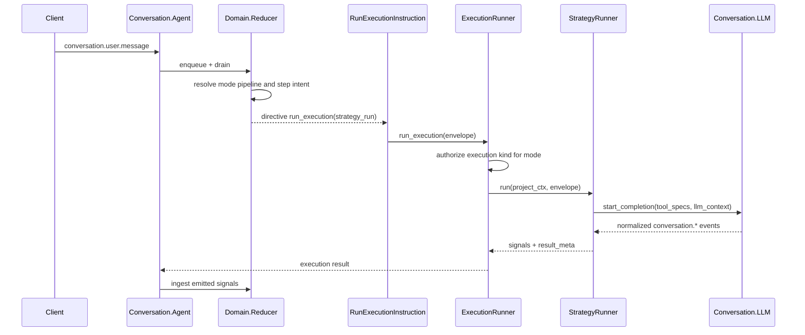
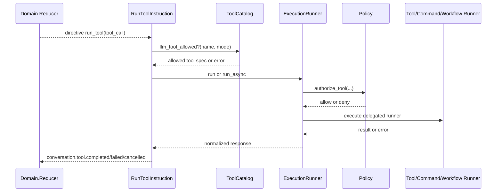
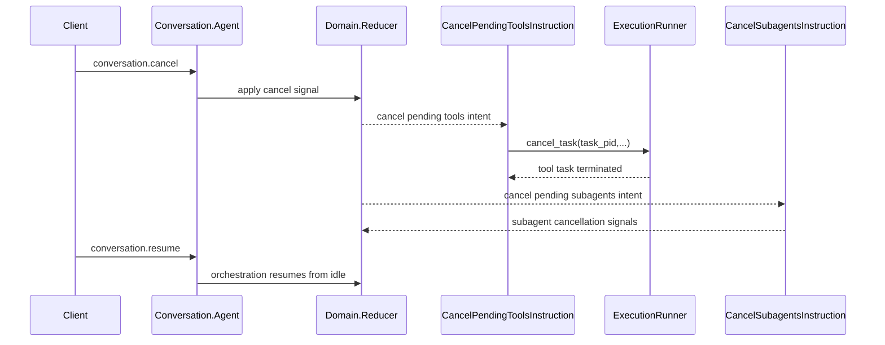
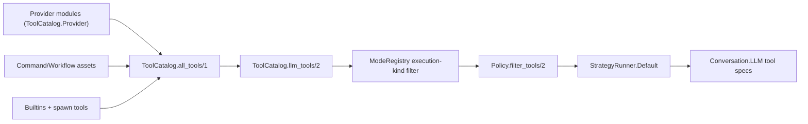

# 06. LLM and Tool Execution

Prev: [05. Conversation Runtime](./05-conversation-runtime.md)  
Next: [07. Sub Agent Runtime](./07-subagent-runtime.md)

## Single Execution Gateway

All execution goes through one gateway: `Project.ExecutionRunner`.

- `RunExecutionInstruction` delegates strategy envelopes to `ExecutionRunner.run_execution/2`.
- `RunToolInstruction` delegates tool calls to `ExecutionRunner.run/2` or `run_async/3`.
- `ExecutionRunner` enforces policy, limits, and guardrails before delegating:
  - `ToolRunner` (`asset.*`, `agent.spawn.*`)
  - `CommandRunner` (`command.run.*`)
  - `WorkflowRunner` (`workflow.run.*`)
  - `StrategyRunner` (`strategy_run`)

No mode, strategy, or tool path is allowed to bypass `ExecutionRunner`.

## Mode Pipeline and Strategy Path

Mode pipeline planning starts in the reducer (`Conversation.Domain.Reducer`) using
`Conversation.Domain.ModePipeline` and `Conversation.ExecutionEnvelope`.

```mermaid
sequenceDiagram
    participant Client as Client
    participant Agent as Conversation.Agent
    participant Reducer as Domain.Reducer
    participant Instr as RunExecutionInstruction
    participant Exec as ExecutionRunner
    participant Strat as StrategyRunner
    participant LLM as Conversation.LLM

    Client->>Agent: conversation.user.message
    Agent->>Reducer: enqueue + drain
    Reducer->>Reducer: resolve mode pipeline and step intent
    Reducer-->>Instr: directive run_execution(strategy_run)
    Instr->>Exec: run_execution(envelope)
    Exec->>Exec: authorize execution kind for mode
    Exec->>Strat: run(project_ctx, envelope)
    Strat->>LLM: start_completion(tool_specs, llm_context)
    LLM-->>Strat: normalized conversation.* events
    Strat-->>Exec: signals + result_meta
    Exec-->>Agent: execution result
    Agent->>Reducer: ingest emitted signals
```

`ModeRegistry` controls mode capabilities, including allowed execution kinds and
supported strategy types.

## Tool Loop Path

Strategy output can emit `conversation.tool.requested`. Tool execution then
flows through the same gateway.

```mermaid
sequenceDiagram
    participant Reducer as Domain.Reducer
    participant ToolInstr as RunToolInstruction
    participant Catalog as ToolCatalog
    participant Exec as ExecutionRunner
    participant Policy as Policy
    participant Runner as Tool/Command/Workflow Runner

    Reducer-->>ToolInstr: directive run_tool(tool_call)
    ToolInstr->>Catalog: llm_tool_allowed?(name, mode)
    Catalog-->>ToolInstr: allowed tool spec or error
    ToolInstr->>Exec: run or run_async
    Exec->>Policy: authorize_tool(...)
    Policy-->>Exec: allow or deny
    Exec->>Runner: execute delegated runner
    Runner-->>Exec: result or error
    Exec-->>ToolInstr: normalized response
    ToolInstr-->>Reducer: conversation.tool.completed/failed/cancelled
```

## Cancellation and Resume Flow

```mermaid
sequenceDiagram
    participant Client as Client
    participant Agent as Conversation.Agent
    participant Reducer as Domain.Reducer
    participant CancelInstr as CancelPendingToolsInstruction
    participant Exec as ExecutionRunner
    participant SubCancel as CancelSubagentsInstruction

    Client->>Agent: conversation.cancel
    Agent->>Reducer: apply cancel signal
    Reducer-->>CancelInstr: cancel pending tools intent
    CancelInstr->>Exec: cancel_task(task_pid,...)
    Exec-->>CancelInstr: tool task terminated
    Reducer-->>SubCancel: cancel pending subagents intent
    SubCancel-->>Reducer: subagent cancellation signals
    Client->>Agent: conversation.resume
    Agent->>Reducer: orchestration resumes from idle
```

## Tool Declaration and LLM Exposure Flow

Tool definitions are assembled in `ToolCatalog` from four sources:

1. built-ins (`asset.list`, `asset.search`, `asset.get`)
2. asset-backed tools (`command.run.*`, `workflow.run.*`)
3. provider modules implementing `ToolCatalog.Provider` (`tools/1`)
4. sub-agent spawn tools (`agent.spawn.<template_id>`)

Only LLM-visible tools are exposed to a turn:

1. `ToolCatalog.llm_tools/2` filters by `llm_exposed`
2. mode policy filters by `ModeRegistry.allowed_execution_kinds/2`
3. runtime policy filters by `Policy.filter_tools/2`
4. `StrategyRunner.Default` passes resulting specs to `Conversation.LLM`

```mermaid
flowchart LR
  A["Provider modules (ToolCatalog.Provider)"] --> B["ToolCatalog.all_tools/1"]
  C["Command/Workflow assets"] --> B
  D["Builtins + spawn tools"] --> B
  B --> E["ToolCatalog.llm_tools/2"]
  E --> F["ModeRegistry execution-kind filter"]
  F --> G["Policy.filter_tools/2"]
  G --> H["StrategyRunner.Default"]
  H --> I["Conversation.LLM tool specs"]
```

At execution time, `RunToolInstruction` re-validates the requested tool with
`ToolCatalog.llm_tool_allowed?/3` and still routes the call through
`ExecutionRunner` guardrails.

## Adapter Notes

`RunLLMInstruction` executes one LLM turn:

1. Emits `conversation.llm.requested`
2. Builds available tool specs from `ToolCatalog`
3. Filters tools through `Policy.filter_tools/2`
4. Resolves context from canonical journal (`JournalBridge.llm_context/3`) when available, otherwise uses in-memory projection fallback
5. Calls `Conversation.LLM.start_completion/4`
6. Re-ingests completion output as canonical conversation signals

`Conversation.LLM` supports adapters:

- `:deterministic` (test/dev deterministic behavior)
- `:jido_ai` (real model call via `Jido.AI.generate_text/2`)
- custom module/function adapters

Message normalization accepts these roles:

- `:user`
- `:assistant`
- `:system`

Current behavior limits tool calls from a single completion to the first call (`Enum.take(1)`).

## Guardrails in ExecutionRunner Gateway

Before execution:

- call normalization (`ToolCall.from_map`)
- schema validation
- env passthrough checks (`tool_env_allowlist`)
- policy authorization (paths, network, allow/deny tools)
- project and per-conversation concurrency quotas

During execution:

- task-supervised run with timeout
- child-process tracking and cleanup
- optional async notify back to conversation server (`meta.run_mode = "async"` or `meta.async = true`)

After execution:

- output and artifact size enforcement
- sensitive artifact scanning
- telemetry emission (`conversation.tool.started`, `conversation.tool.completed`, `conversation.tool.failed`, timeout/security events)

## Jido Tool Calling Integration

`Project.ToolActionBridge` can expose runtime tools as generated `Jido.Action` modules for Jido.AI tool-calling contexts while still delegating execution to `ExecutionRunner`.

This means there are two invocation styles, one execution core:

- Conversation-native tool path (`RunToolInstruction` + `ToolBridge`)
- Jido.AI action path (`ToolActionBridge` generated actions)

Both converge on `ExecutionRunner` policy enforcement, guardrails, and delegated runner dispatch.

## Security Aside

Network-capable tools are hidden from `list_tools` and blocked at execution time unless `network_egress_policy` allows them and endpoint/scheme rules pass.
