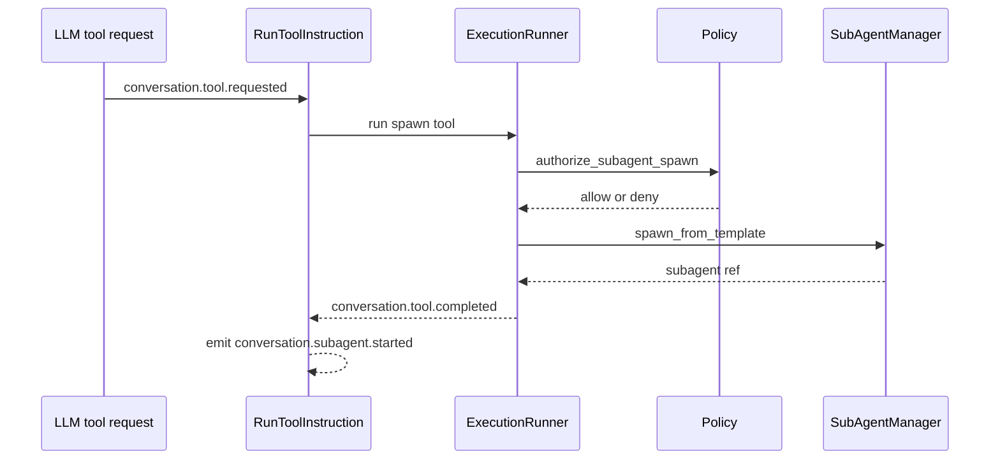

# 07. Sub Agent Runtime

Prev: [06. LLM and Tool Execution](./06-llm-and-tool-execution.md)  
Next: [08. Protocol Gateways](./08-protocol-gateways.md)

## Why Sub Agents Exist

Sub-agents allow bounded delegation from a conversation to specialized agent templates while preserving policy controls and observability.

## Template Model

`Project.SubAgentTemplate` defines:

- `template_id`
- `agent_module`
- `initial_state`
- `allowed_tools`
- `network_policy`
- `env_allowlist`
- `ttl_ms`
- `max_children_per_conversation`
- `spawn_timeout_ms`

Spawn capability is exposed as tool names: `agent.spawn.<template_id>`.

## Spawn Flow

## SubAgentManager Responsibilities

- Quota enforcement per conversation
- Child process start and monitor
- TTL expiry handling
- Stop all children on conversation cancel or stop
- Emit lifecycle notifications to `Project.Server`

`Project.Server` re-ingests lifecycle signals:

- `conversation.subagent.started`
- `conversation.subagent.completed`
- `conversation.subagent.failed`
- `conversation.subagent.stopped`

## Conversation Integration

Conversation domain tracks active and terminal children in projections via `pending_subagents` and `subagent_status` projection summaries.

## Failure Handling

- Policy denial -> tool failure + security telemetry
- Invalid template/module -> spawn failure
- Quota exceeded -> denied with dedicated security event
- TTL expiry -> child kill path and emitted denial telemetry

## Security Aside

Arbitrary module spawn is not exposed in tool APIs. Spawn happens only via allowlisted template tools and explicit policy authorization.
