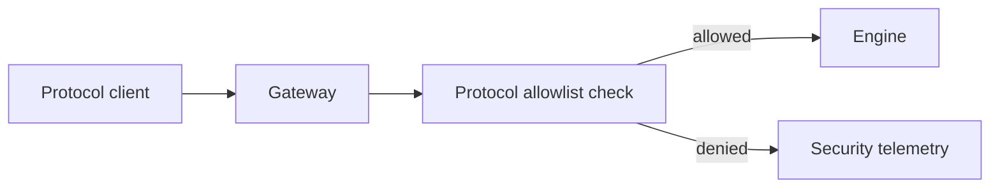

# 08. Protocol Gateways

Prev: [07. Sub Agent Runtime](./07-subagent-runtime.md)  
Next: [09. Security Model](./09-security-model.md)

## Purpose

Protocol adapters translate external protocol operations into the same project and conversation runtime operations.

Implemented global gateways:

- `Protocol.MCP.Gateway`
- `Protocol.A2A.Gateway`

## MCP Gateway

`Protocol.MCP.Gateway` supports:

- `tools_list(project_id)`
- `tools_call(project_id, tool_call)`
- `send_message(project_id, conversation_id, content)`

Message send maps to `conversation.user.message` and calls `Engine.conversation_call/4`.

Per-project wrapper: `Protocol.MCP.ProjectServer`.

## A2A Gateway

`Protocol.A2A.Gateway` supports:

- `agent_card`
- `task_create`
- `message_send`
- `task_cancel`
- task subscribe/unsubscribe

Task ids map directly to conversation ids.

## Access Control

Both gateways call `Engine.protocol_allowed?/2` before handling operations. Denials emit `security.protocol_denied` telemetry.

## Design Notes

- Adapters are intentionally thin.
- Core behavior stays in project runtime modules.
- External protocol differences are normalized to the same signal/tool APIs.

## Security Aside

Protocol checks are per project, so one project can expose MCP/A2A while another project remains closed.
