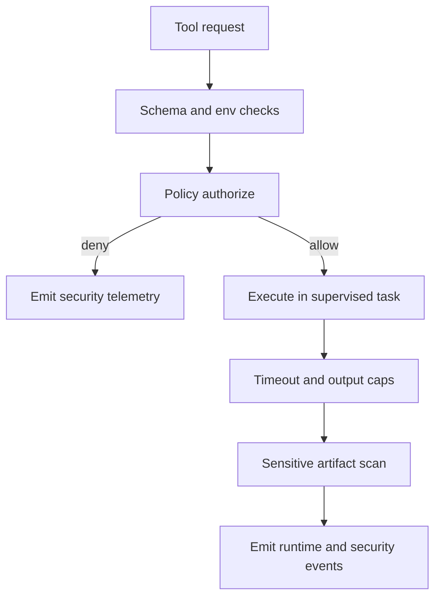

# 09. Security Model

Prev: [08. Protocol Gateways](./08-protocol-gateways.md)  
Next: [10. Observability and Operations](./10-observability-and-operations.md)

## Security Posture Summary

Security is enforced as layered controls:

1. Input and schema validation
2. Policy authorization before execution
3. Runtime guardrails during execution
4. Telemetry and incident correlation after execution

## Policy Layer (`Project.Policy`)

### Tool Surface Control

- `allow_tools` and `deny_tools`
- sub-agent template allowlist for `agent.spawn.*`

### Path Sandbox Controls

- root normalization and symlink-safe checks
- deny outside-root access by default
- optional reason-coded outside-root allowlist
- sensitive path denylist with explicit allowlist override

### Network Egress Controls

- default deny (`network_egress_policy = :deny`)
- endpoint allowlist host checks
- protocol/scheme allowlist checks
- deep argument inspection (nested maps/lists/json/opaque blobs)

### Environment Controls

- env payloads for command/workflow tools require explicit allowed keys (`tool_env_allowlist`)

## Execution Layer (`Project.ToolRunner`)

- timeout control per call
- output and artifact byte caps
- per-project and per-conversation concurrency controls
- child process tracking and forced cleanup on cancel/timeout
- sensitive artifact scanning in result payloads

## Conversation Safety Controls

- queue max size and max drain steps
- deterministic queue overflow signal (`conversation.queue.overflow`)
- cancel flow that terminates pending tools and sub-agents

## Telemetry Security Signals

Representative events:

- `security.sandbox_violation`
- `security.sandbox_exception_used`
- `security.network_denied`
- `security.sensitive_path_denied`
- `security.env_denied`
- `security.sensitive_artifact_detected`
- `security.repeated_timeout_failures`
- `security.subagent.spawn_denied`
- `security.subagent.quota_denied`
- `security.protocol_denied`

## Correlation and Forensics

`Correlation` IDs are generated or propagated at signal/tool boundaries and included in policy decisions, tool telemetry, and incident timelines.
