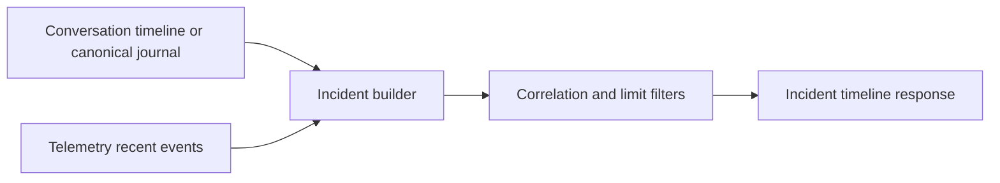

# 10. Observability and Operations

Prev: [09. Security Model](./09-security-model.md)  
Next: [11. Testing and Quality](./11-testing-and-quality.md)

## Telemetry Architecture

`Jido.Code.Server.Telemetry` provides:

- `emit/2` wrapper over `:telemetry.execute`
- in-memory per-project counters
- recent event/error ring buffers
- payload redaction for sensitive keys and token patterns

## Diagnostics APIs

### Project-Level

`Jido.Code.Server.diagnostics/1` includes:

- runtime options (selected fields)
- health summary (`ok` or `degraded`)
- asset diagnostics
- policy diagnostics
- telemetry snapshot
- per-conversation diagnostics

### Conversation-Level

- `conversation_diagnostics/2` returns projection-backed runtime stats.
- `conversation_projection/4` returns domain projections (`timeline`, `llm_context`, `diagnostics`, `pending_tool_calls`, `subagent_status`) and canonical journal projections (`canonical_timeline`, `canonical_llm_context`).
- `incident_timeline/3` merges conversation timeline and telemetry events with optional correlation filtering and bounded limits.

## Incident Timeline Model

`Project.Server` merges two sources:

- conversation timeline entries
- telemetry recent events

When a conversation process is no longer active, incident lookup falls back to canonical journal events via `Conversation.JournalBridge.events/2`.

It sorts by timestamp/source rank and returns recent bounded entries.

## Alerts

`AlertRouter` forwards selected security/timeout events to an external callback configured in runtime config:

- `:alert_signal_events`
- `:alert_router`

## Operator Checklist

- Verify project runtime options in diagnostics.
- Check policy recent decisions for denied/allowed context.
- Inspect conversation diagnostics for queue/pending call pressure.
- Use incident timeline with `correlation_id` for targeted forensics.
