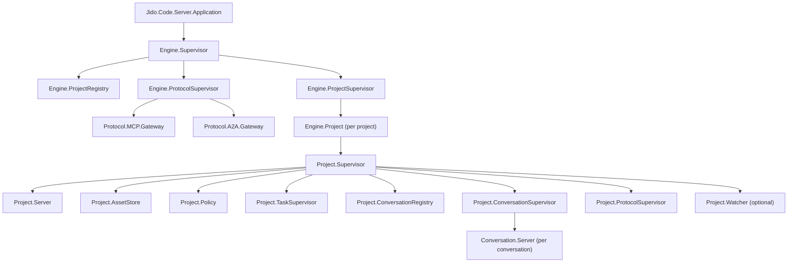

# Architecture Overview

`Jido.Code.Server` is a multi-project runtime where each project is an isolated container and each conversation is an event-driven runtime instance.

## Design Principles

1. Project is the isolation boundary.
   - Supervision, policy, tool execution, and shared assets are project-scoped.
2. Conversation is event-driven.
   - Conversations ingest events and maintain projection caches.
3. Adapters are translators.
   - MCP/A2A map protocol operations to runtime APIs; they do not own state machines.
4. Tool execution has one path.
   - Tool calls are filtered by policy and executed by the project tool runner.

## Supervision Topology

## Core Runtime Surface

Public API lives in `lib/jido_code_server.ex` and delegates to the engine.

- Project lifecycle:
  - `start_project/2`, `stop_project/1`, `list_projects/0`
- Conversation lifecycle:
  - `start_conversation/2`, `stop_conversation/2`
- Runtime operations:
  - `send_event/3`, `get_projection/3`, `list_tools/1`, `run_tool/2`
- Diagnostics:
  - `assets_diagnostics/1`, `conversation_diagnostics/2`, `diagnostics/1`, `incident_timeline/3`

## Component Boundaries

- Engine layer (`lib/jido_code_server/engine*.ex`)
  - Multiplexes and validates project lifecycle.
- Project layer (`lib/jido_code_server/project/*.ex`)
  - Owns layout, assets, policy, tool execution, and conversation routing.
- Conversation layer (`lib/jido_code_server/conversation/*.ex`)
  - Owns event ingestion and orchestration behavior.
- Adapter layer (`lib/jido_code_server/protocol/**/*.ex`)
  - Maps external protocol actions to runtime calls.
- Observability layer (`lib/jido_code_server/telemetry.ex`)
  - Emits and stores bounded diagnostics signals.

> Security Aside
> 
> Architectural boundaries are a primary control: adapters cannot bypass project policy/tool runner boundaries, and conversations cannot execute tools directly.
