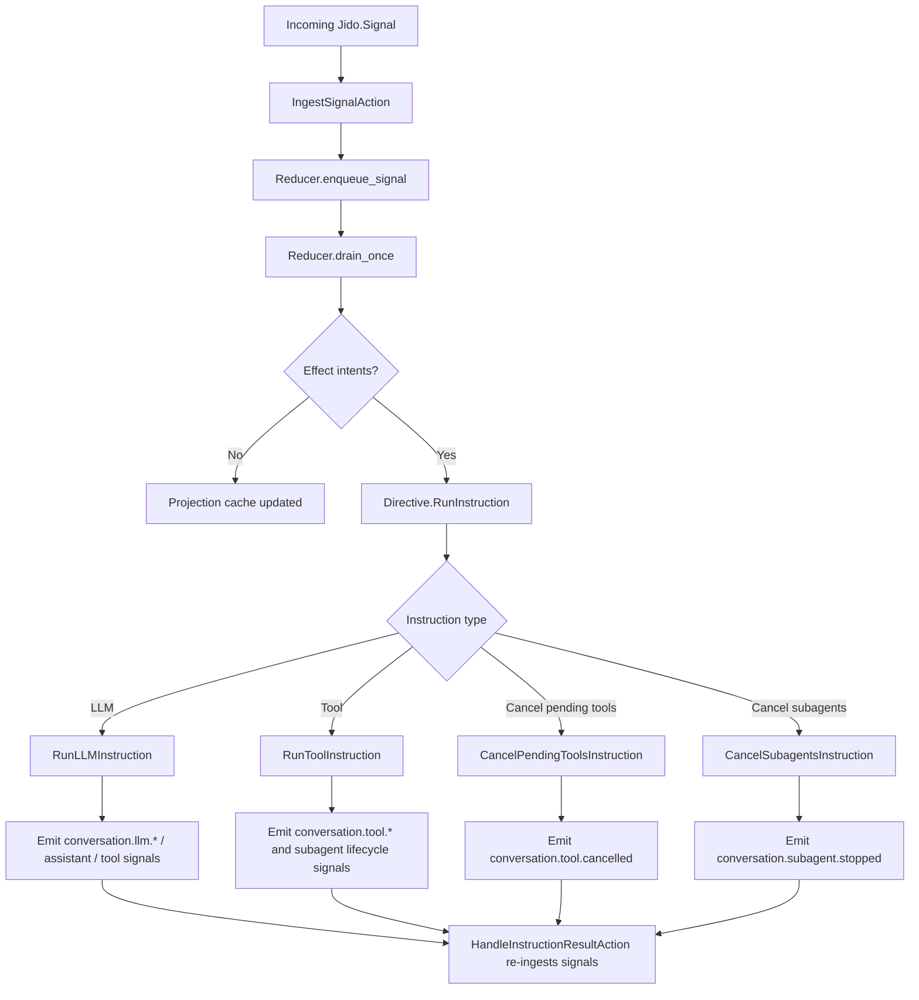

# Conversation Runtime

Conversations run as native `Jido.AgentServer` workers over a signal-first domain reducer.

## Main Modules

- `lib/jido_code_server/conversation/agent.ex`
- `lib/jido_code_server/conversation/domain/state.ex`
- `lib/jido_code_server/conversation/domain/reducer.ex`
- `lib/jido_code_server/conversation/domain/projections.ex`
- `lib/jido_code_server/conversation/actions/*.ex`
- `lib/jido_code_server/conversation/instructions/*.ex`
- `lib/jido_code_server/conversation/llm.ex`
- `lib/jido_code_server/conversation/tool_bridge.ex`
- `lib/jido_code_server/conversation/signal.ex`

## Conversation State Model

Core state fields in `Conversation.Domain.State`:

- `timeline`
- `pending_tool_calls`
- `pending_subagents`
- `event_queue`, `queue_size`, `seen_signals`
- `projection_cache`
- `status` (`:idle | :running | :cancelled`)
- `correlation_index`
- `drain_iteration`

## Event Ingestion and Orchestration

## LLM Adapter Modes

`Conversation.LLM` supports:

- Deterministic mode (`:deterministic`) for stable tests and predictable behavior.
- `:jido_ai` mode using `Jido.AI.generate_text`.
- Custom adapter module/function forms.

LLM lifecycle events include:

- `conversation.llm.requested`
- `conversation.assistant.delta`
- `conversation.tool.requested` (when tool call intent is returned)
- `conversation.assistant.message`
- `conversation.llm.completed`
- `conversation.llm.failed`

## Tool Bridge Behavior

`Conversation.ToolBridge` supports both sync and async execution.

- Sync path calls `ToolRunner.run/2` and emits immediate `conversation.tool.completed`/`conversation.tool.failed`.
- Async path calls `ToolRunner.run_async/3`, stores pending task refs, then ingests result messages when tasks finish.
- `conversation.cancel` cancels pending tasks and emits deterministic `conversation.tool.cancelled` signals.
- `conversation.cancel` also stops active sub-agents and emits deterministic `conversation.subagent.stopped` signals.

## Sub-Agent Lifecycle Signals

Sub-agent templates are surfaced as spawn tools (`agent.spawn.<template_id>`) and emit:

- `conversation.subagent.requested`
- `conversation.subagent.started`
- `conversation.subagent.completed`
- `conversation.subagent.failed`
- `conversation.subagent.stopped`

## Projections and Diagnostics

`Conversation.Agent` exposes projection reads and runtime diagnostics, including:

- event count
- pending tool call count
- last event type/time
- projection keys

Conversation subscriptions (`Runtime.subscribe_conversation/3`) emit canonical runtime signals:

- `{:conversation_signal, conversation_id, signal_map}`
- `{:conversation_delta, conversation_id, signal_map}` for `conversation.assistant.delta`

> Security Aside
> 
> Correlation IDs are enforced and propagated through incoming events, LLM lifecycle events, and tool events to support incident stitching and forensic timelines.
