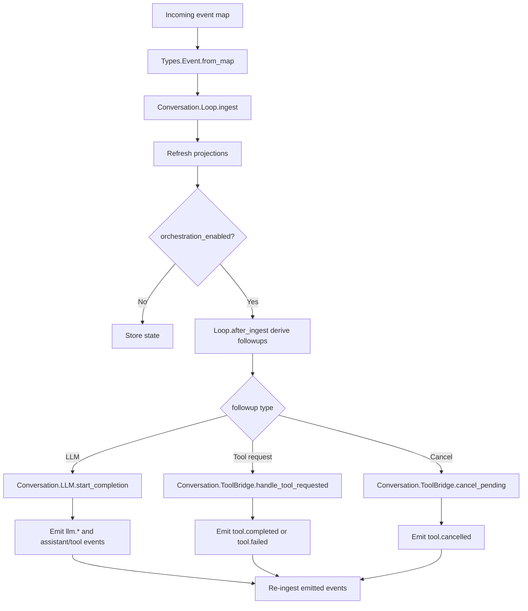

# Conversation Runtime

Conversations are implemented as thin server wrappers over event-based state transitions.

## Main Modules

- `lib/jido_code_server/conversation/server.ex`
- `lib/jido_code_server/conversation/loop.ex`
- `lib/jido_code_server/conversation/llm.ex`
- `lib/jido_code_server/conversation/tool_bridge.ex`
- `lib/jido_code_server/types/event.ex`

## Conversation State Model

Core state fields in `Conversation.Loop`:

- `events`, `raw_timeline`
- `pending_tool_calls`, `cancelled_tool_calls`
- `projection_cache`
- `status` (`:idle | :cancelled`)
- `last_event`

## Event Ingestion and Orchestration

## LLM Adapter Modes

`Conversation.LLM` supports:

- Deterministic mode (`:deterministic`) for stable tests and predictable behavior.
- `:jido_ai` mode using `Jido.AI.generate_text`.
- Custom adapter module/function forms.

LLM lifecycle events include:

- `llm.started`
- `assistant.delta`
- `tool.requested` (when tool call intent is returned)
- `assistant.message`
- `llm.completed`
- `llm.failed`

## Tool Bridge Behavior

`Conversation.ToolBridge` supports both sync and async execution.

- Sync path calls `ToolRunner.run/2` and emits immediate `tool.completed`/`tool.failed`.
- Async path calls `ToolRunner.run_async/3`, stores pending task refs, then ingests result messages when tasks finish.
- `conversation.cancel` cancels pending tasks and emits deterministic `tool.cancelled` events.

## Projections and Diagnostics

`Conversation.Server` exposes projection reads and local diagnostics, including:

- event count
- pending tool call count
- last event type/time
- projection keys

> Security Aside
> 
> Correlation IDs are enforced and propagated through incoming events, LLM lifecycle events, and tool events to support incident stitching and forensic timelines.
