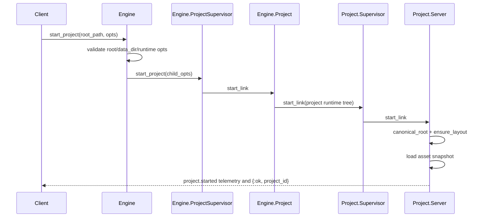

# Engine and Project Lifecycle

This guide covers startup and project runtime behavior.

## Engine Responsibilities

Engine behavior is implemented in `lib/jido_code_server/engine.ex`.

- Validates project bootstrap inputs.
- Starts one `Engine.Project` process per `project_id`.
- Routes runtime calls to the target project process.

## Project Startup Sequence

## Runtime Option Handling

Runtime options are validated before project startup in `Engine.start_project/2`.

Validated categories include:

- Positive integers:
  - `tool_timeout_ms`, `tool_max_output_bytes`, `tool_max_artifact_bytes`, `tool_max_concurrency`
- Non-negative integers:
  - `tool_max_concurrency_per_conversation`
- Booleans:
  - `watcher`, `conversation_orchestration`, `strict_asset_loading`
- List-of-strings:
  - network, sensitive-path, env allowlist, protocol allowlist options
- Enumerated options:
  - `network_egress_policy`, `command_executor`
- Structured allowlist:
  - `outside_root_allowlist` entries with required `path|pattern` and `reason_code`

Unknown options are rejected with `{:invalid_runtime_opt, key, :unknown_option}`.

## Project Runtime Tree

Project supervision is assembled in `lib/jido_code_server/project/supervisor.ex`.

Children:

- `Project.ConversationRegistry`
- `Project.ConversationSupervisor`
- `Project.AssetStore`
- `Project.Policy`
- `Project.TaskSupervisor`
- `Project.ProtocolSupervisor`
- `Project.Server`
- `Project.Watcher` (optional)

## Filesystem Layout

`Project.Layout` ensures this structure under `<root>/<data_dir>`:

- `skills/`
- `commands/`
- `workflows/`
- `skill_graph/`
- `state/`

Default `data_dir` is `.jido`.

## Asset Lifecycle

Asset loading is owned by `Project.AssetStore`.

- Initial load on project startup.
- Reload via `Jido.Code.Server.reload_assets/1`.
- Optional debounced file watcher reload (`Project.Watcher`).
- Strict mode (`strict_asset_loading: true`) fails startup when loader errors exist.

> Security Aside
> 
> Rejecting malformed runtime options at startup prevents accidental weakening of guardrails (for example invalid allowlists or nil policy defaults).
