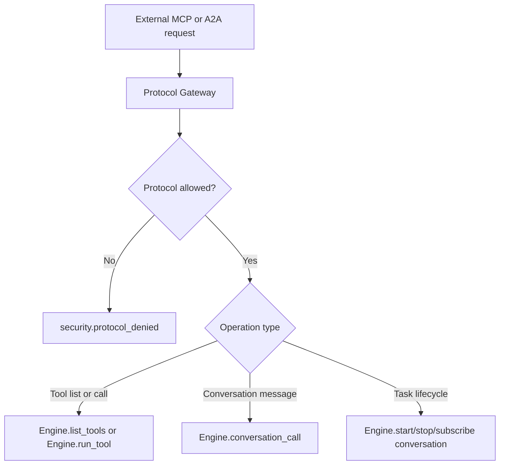

# Protocol Adapters

Protocol adapters expose runtime capabilities without duplicating runtime state.

## Adapter Modules

- `lib/jido_code_server/protocol/mcp/gateway.ex`
- `lib/jido_code_server/protocol/mcp/project_server.ex`
- `lib/jido_code_server/protocol/a2a/gateway.ex`
- `lib/jido_code_server/engine/protocol_supervisor.ex`

## Request Mapping

## MCP Gateway Behavior

`Protocol.MCP.Gateway` supports:

- `tools_list(project_id)`
- `tools_call(project_id, tool_call)`
- `send_message(project_id, conversation_id, content, opts)`

Each operation checks project protocol access via `Engine.protocol_allowed?/2`.

## A2A Gateway Behavior

`Protocol.A2A.Gateway` supports:

- `agent_card(project_id)`
- `task_create(project_id, content, opts)`
- `message_send(project_id, task_id, content, opts)`
- `task_cancel(project_id, task_id, opts)`
- `subscribe_task` / `unsubscribe_task`

A2A task IDs map directly to conversation IDs.

## Project-Scoped MCP Server

`Protocol.MCP.ProjectServer` is a per-project wrapper delegating to the global MCP gateway logic.

## Adapter Design Rules

1. Do not store durable runtime state in adapters.
2. Do not bypass engine/project APIs.
3. Do not bypass policy by performing direct tool execution.
4. Preserve correlation and source metadata in emitted events.

> Security Aside
> 
> Protocol access is explicitly allowlisted per project (`protocol_allowlist`), so enabling a protocol is a project-level exposure decision, not a global assumption.
