# Tool Execution and Policy

All tool execution goes through a unified project path:

1. Tool inventory from `Project.ToolCatalog`
2. Authorization by `Project.Policy`
3. Execution by `Project.ToolRunner`

## Tool Catalog Composition

`Project.ToolCatalog` merges:

- Built-in asset tools:
  - `asset.list`, `asset.search`, `asset.get`
- Asset-backed command tools:
  - `command.run.<name>`
- Asset-backed workflow tools:
  - `workflow.run.<name>`
- Sub-agent spawn tools:
  - `agent.spawn.<template_id>`

For valid command/workflow definitions, `input_schema` includes richer typed fields (including nested `params`/`inputs` hints).

## Policy and Execution Pipeline

```mermaid
flowchart LR
    A["Runtime.run_tool"] --> B["Project.Server.run_tool"]
    B --> C["ToolRunner.normalize_call"]
    C --> D["ToolCatalog.get_tool"]
    D --> E["ToolRunner.validate_tool_args"]
    E --> F["ToolRunner.enforce_env_controls"]
    F --> G["Policy.authorize_tool"]
    G --> H["ToolRunner.acquire_capacity"]
    H --> I["ToolRunner.execute_within_task"]
    I --> J["Command or workflow runtime"]
    J --> K["Result limits and sensitivity scan"]
    K --> L["tool.completed or tool.failed telemetry"]
```

## ToolRunner Responsibilities

`Project.ToolRunner` enforces:

- Tool arg schema validation (including nested object/array checks)
- Timeouts and cancellation handling
- Project-wide and per-conversation concurrency caps
- Output/artifact size limits
- Environment passthrough allowlist controls for command/workflow tools
- Child-process tracking and termination for timeout/cancel cleanup

Runtime result handling includes:

- Sensitive artifact detection flags
- Timeout escalation telemetry
- Security telemetry for denied env usage
- Sub-agent spawn execution with template-gated policy checks

## Command and Workflow Runtime Bridges

Asset-backed execution paths:

- Command definitions execute through `JidoCommand.Extensibility.CommandRuntime`
- Workflow definitions execute through `JidoWorkflow.Workflow.Engine`
- Invalid definitions degrade to preview mode to preserve compatibility

Optional executor mode:

- `command_executor: :workspace_shell` routes command execution through `Project.CommandExecutor.WorkspaceShell` (`jido_workspace`).

## Policy Responsibilities

`Project.Policy` enforces:

- Tool allow/deny lists
- Filesystem path normalization and sandbox checks
- Sensitive path deny/allow lists
- Outside-root reason-coded exceptions
- Network egress policy, scheme, and allowlist controls
- Network target extraction from nested, JSON-wrapped, and opaque serialized payloads
- Policy decision audit records and security signal emission
- Sub-agent template allowlist checks (`subagent_templates_allowlist`)

> Security Aside
> 
> Policy and runner checks are intentionally layered: even allowlisted tools still pass argument validation, path/network controls, runtime limits, and telemetry auditing.
